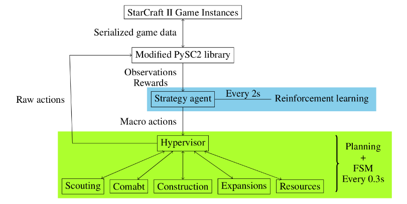

# YuLung
YuLung (雨龍) - A Zerg StarCraft II agent.

It is a reinforcement learning agent built on a modular interface. 
We focus only on the *strategy* of the agent. To this end, we have designed
the action space in a way that the agent cannot exploit micro control.
For instance, the agent can only attack by issuing an attack-ground comand
to all army units at the same time.
We expect the agent to develop macro skills, using robust economy and 
suitable unit composition to defeat the opponent. 

Check out our video demonstration [here](https://www.youtube.com/playlist?list=PL6mPv2H5ySBphXeYMmoz1xdw6g1fZhX1N).

# Dependencies
A modded version of pysc2 (https://github.com/silver-rush/pysc2) that
exposes the raw interface.

Training: https://github.com/hkchengrex/pytorch-a2c-ppo-acktr-gail.

# Testing scripts

Running the test bot: 

`python -m pysc2.bin.agent --map CollectMineralShards --agent bot.sample_agent.CollectMineralShards`

To generate static unit information (Might need manual clean up for pygame output):

`python -m bot.util.gen_units_data | tee bot/util/static_units.py`
